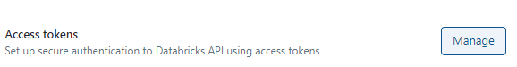
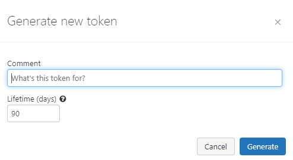
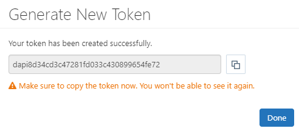

# Databricks Lib

Para instalar esta biblioteca, faça o download do arquivo dist/databricks-0.11.tar.gz e rode o comando

```bash
    pip install ./databricks-0.11.tar.gz
```


## Url

Para obter a url, basta abrir o databricks e copiar o link anterior a '/'.


## Token

Para obter o token, acesse o databricks, vá em User Settings -> Developer -> Access Token -> Manage



Clique em Generate new token e escolha o tempo em que este irá expirar.



Uma chave será gerada, copie-a e use em seu código.

